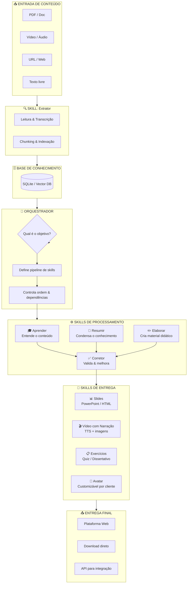

# Arquitetura da Plataforma

## Fluxo Geral

---

## Detalhamento das Skills

| Skill | Responsabilidade | Status atual |
|-------|-----------------|--------------|
| **Extrator** | Lê PDF, áudio, vídeo, URL, texto | ✅ Existe |
| **Aprender** | Processa e entende o conteúdo | ⚠️ Parcial (está no agente) |
| **Resumir** | Gera resumos por nível | ✅ Existe |
| **Elaborar** | Cria material didático completo | ⚠️ Parcial (slides, script) |
| **Corretor** | Valida coerência e qualidade | ❌ Não existe |
| **Slides** | Exporta em PPTX/HTML | ✅ Existe |
| **Vídeo + Narração** | TTS + geração de vídeo | ❌ Não existe |
| **Exercícios** | Quiz + perguntas abertas | ✅ Existe |
| **Avatar** | Avatar customizado por cliente | ❌ Não existe |
| **Orquestrador** | Gerencia pipeline de skills | ⚠️ Parcial (muito acoplado) |

---

## Visão de Custos (por execução estimada)

### Processamento de conteúdo (Claude API)
| Operação | Tokens estimados | Custo aprox. (BRL) |
|----------|-----------------|---------------------|
| Resumo de 50 págs PDF | ~40k tokens | R$ 0,60 – R$ 2,00 |
| Quiz completo | ~10k tokens | R$ 0,15 – R$ 0,50 |
| Roteiro de vídeo | ~15k tokens | R$ 0,22 – R$ 0,75 |
| Slides (20 slides) | ~20k tokens | R$ 0,30 – R$ 1,00 |
| **Pipeline completo** | ~85k tokens | **R$ 1,30 – R$ 4,25** |

> Referência: Claude Sonnet 4.6 — ~US$ 3/M tokens input, ~US$ 15/M tokens output. Câmbio ~R$ 5,80.

### Transcrição de áudio/vídeo
| Serviço | Custo | Observação |
|---------|-------|------------|
| Whisper (local) | Grátis | Lento, requer GPU ou CPU |
| AssemblyAI | ~US$ 0,65/hora (~R$ 3,77) | Nuvem, rápido |
| OpenAI Whisper API | ~US$ 0,36/hora (~R$ 2,09) | Boa relação custo/qualidade |

### Narração (Text-to-Speech)
| Serviço | Custo | Observação |
|---------|-------|------------|
| ElevenLabs | ~US$ 0,30/1k chars (~R$ 1,74) | Qualidade alta, vozes naturais |
| OpenAI TTS | ~US$ 0,015/1k chars (~R$ 0,09) | Mais barato, qualidade ok |
| Google TTS | Grátis até 4M chars/mês | Qualidade média |

### Avatar
| Serviço | Custo | Observação |
|---------|-------|------------|
| HeyGen | ~US$ 0,08/seg vídeo (~R$ 0,46) | Avatares realistas |
| D-ID | ~US$ 0,10/seg vídeo (~R$ 0,58) | Similar ao HeyGen |
| Synthesia | Plano mensal (~R$ 290/mês) | Mais completo, menos flexível via API |

### Estimativa por curso completo (ex: 10 módulos)
| Componente | Custo estimado (BRL) |
|------------|----------------------|
| Processamento Claude | R$ 13 – R$ 42 |
| Transcrição (se houver áudio) | R$ 4 – R$ 20 |
| Narração TTS | R$ 5 – R$ 30 |
| Avatar (10 vídeos de 3 min) | R$ 83 – R$ 104 |
| **Total por curso** | **R$ 105 – R$ 196** |

---

## Próximos passos sugeridos

1. **Refatorar o orquestrador** — separar bem as skills do agente atual
2. **Criar interface web simples** — para disparar o pipeline e ver resultados
3. **Adicionar skill Corretor** — validação de qualidade antes de entregar
4. **Integrar TTS** — narração para os roteiros já gerados
5. **Explorar avatar** — HeyGen ou D-ID via API
